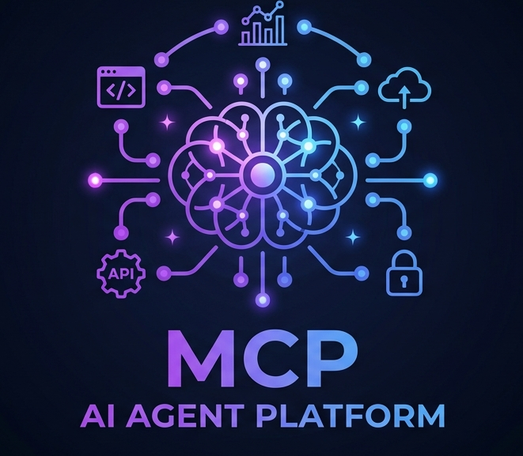
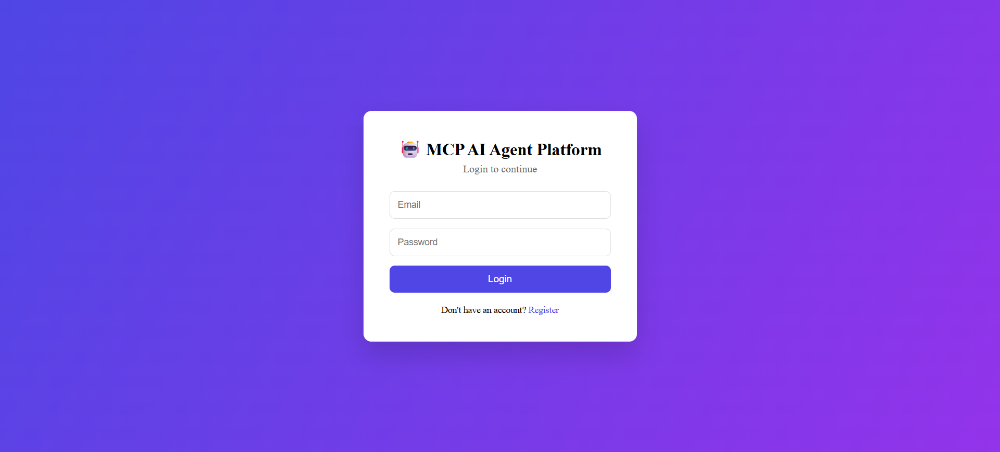
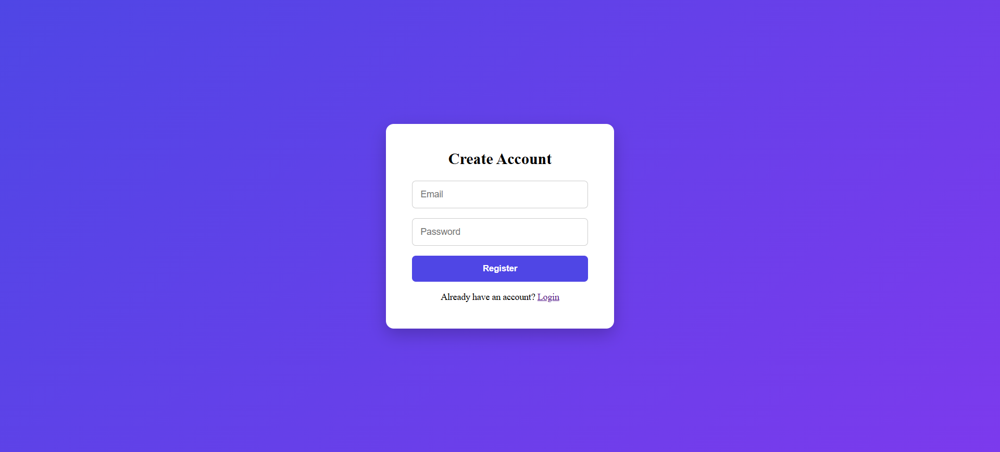
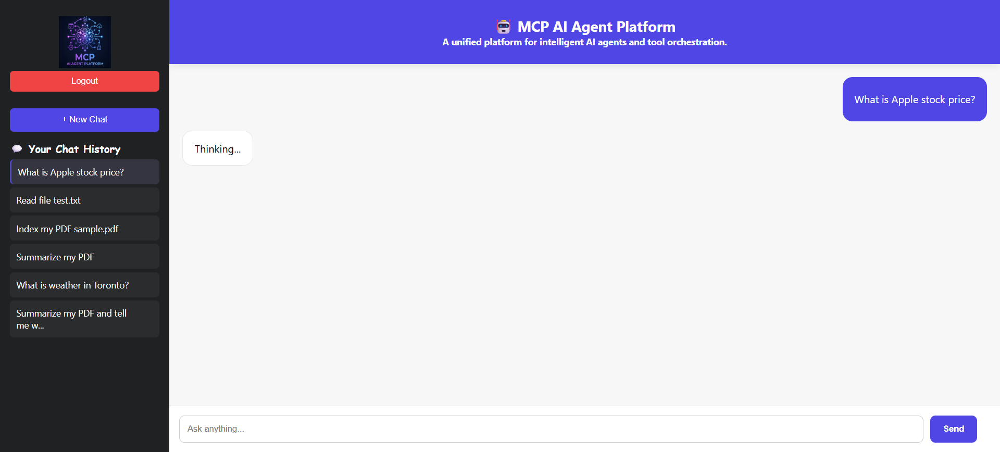
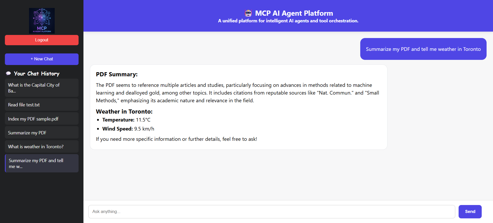
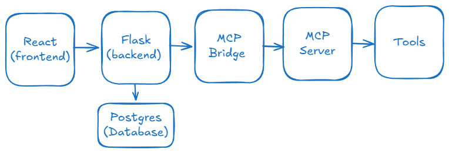

# 🚀 MCP AI Agent Platform




**One AI. Unlimited Tools.**

A production-ready multi-tool AI agent system that combines RAG (PDF search), database querying, file processing, and real-time APIs into a unified intelligent assistant.


---

## 📸 Screenshots

### 🔐 Authentication (Login / Register)



---

### 💬 Chat Interface (ChatGPT-style UI)


---

### 📂 Multi-tool AI Responses


---

## 🧠 Features

- 🤖 ChatGPT-style AI interface
- 🧩 Multi-tool AI agent orchestration
- 📄 RAG-based PDF search & summarization
- 🌦️ Weather API integration
- 📈 Stock price lookup
- 📂 File reading & processing
- 🧠 Sentiment analysis
- 🧮 Calculator tool
- 🗄️ Database query tool
- 🔐 JWT Authentication (Login/Register)
- 💬 Chat session history (save, rename, delete)

---

## 🏗️ Architecture

```text
Frontend (React)
│
▼
Backend API (Flask)
│
▼
MCP Bridge (Node.js)
│
▼
MCP Server (Tools Layer)
├── Weather API
├── Stock API
├── File System
├── PDF (RAG)
├── Database (Postgres)
├── Sentiment Analysis
└── Calculator
```
---

## 🧩 Architecture Diagram (Visual)



---

## ⚙️ Tech Stack

### 🔹 Frontend
- React (Vite)
- TypeScript
- Axios

### 🔹 Backend
- Flask (Python)
- SQLAlchemy
- JWT Authentication

### 🔹 AI Layer
- MCP Server (Node.js)
- Multi-tool agent orchestration
- RAG (PDF search)

### 🔹 Database
- PostgreSQL / MySQL

---

## 🔄 How It Works

1. User sends query from React UI  
2. Flask backend authenticates user (JWT)  
3. Request forwarded to MCP Bridge  
4. MCP Agent decides which tool(s) to use  
5. Tools execute (weather, DB, RAG, etc.)  
6. Response returned to frontend  

---

## 🧪 Example Queries

- What is the weather in Toronto?
- Read file test.txt
- Summarize my PDF
- What is Apple stock price?
- Analyze sentiment: "I love this product"

---

## 🚀 Getting Started

### 1️⃣ Clone Repo
```bash
git clone https://github.com/sanjoy-kumar/mcp-ai-agent-platform.git
cd mcp-ai-agent-platform
```

### 2️⃣ Start MCP Server
```bash
cd mcp-server
node index.mjs
```

### 3️⃣ Start MCP Bridge

```bash
cd mcp-bridge
node server.js
```


### 4️⃣ Start Backend

```bash
cd backend
python app.py
```

### 5️⃣ Start Frontend
```bash
cd frontend
npm install
npm run dev
```
---

## 🔐 Environment Variables

Create .env file:

```json
JWT_SECRET=your_super_secret_key
DB_URL=your_database_url
OPENAI_API_KEY=your_api_key
```

---

## 📌 Future Improvements

- 🔄 Streaming responses (real-time typing)
- 📤 File upload UI
- 🧠 AI-generated chat titles
- 📊 Analytics dashboard
- 🌐 Deployment (Docker + Cloud)

---

## 📜 License

MIT License

---

## 👨‍💻 Author

Sanjoy Kumar Das

---
